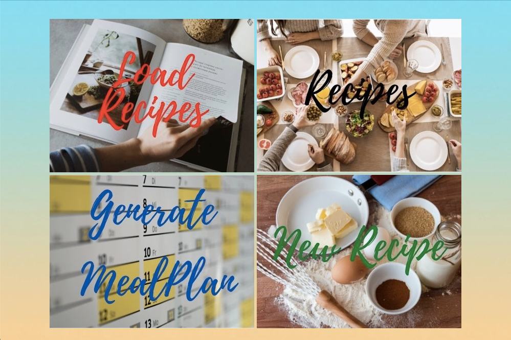
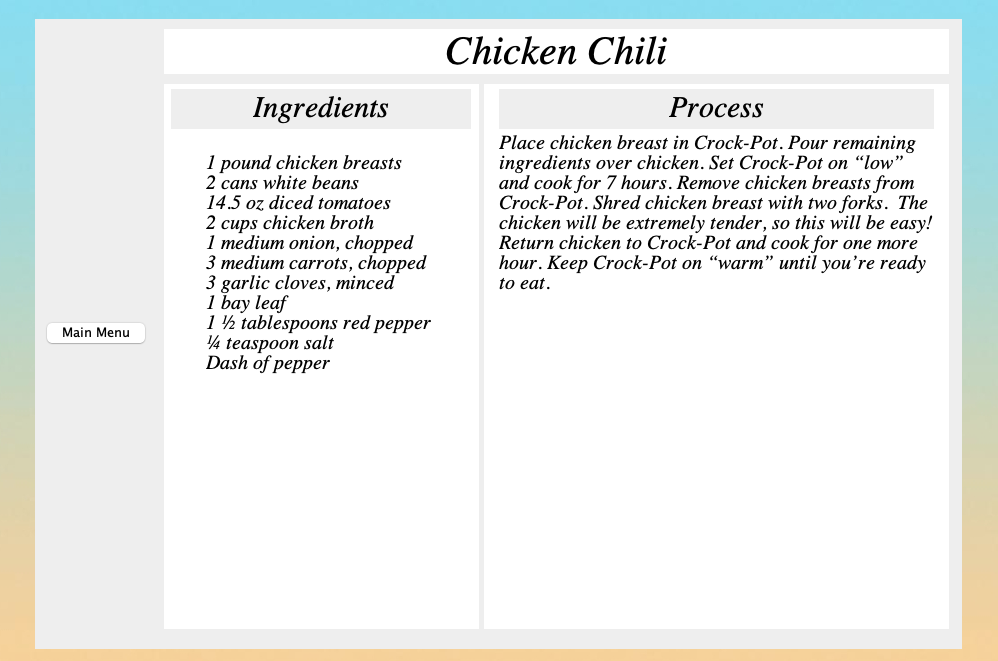
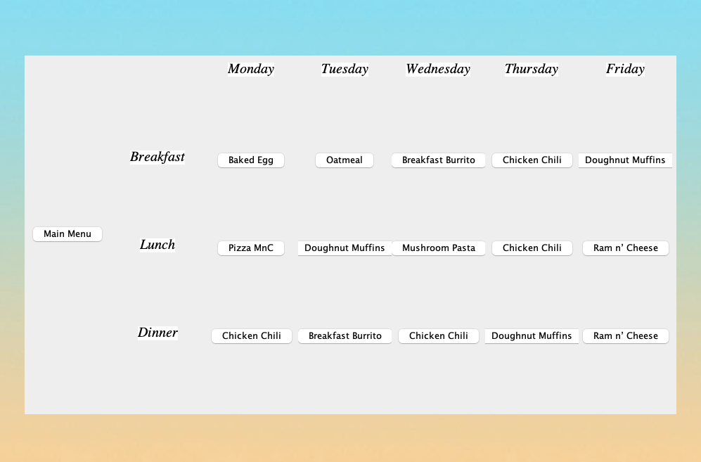
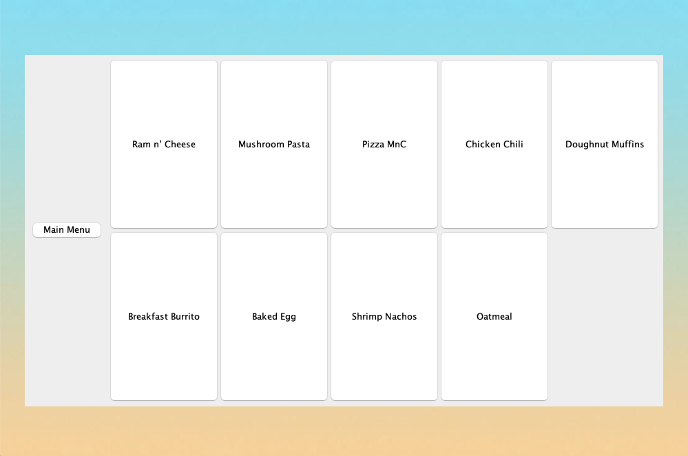

# MEal Plan

## You are what you eat, but who knows what to eat?

### Inspiration

Every night before heading to bed my mother and 
grandmother have a very **worrying** conversation with 
each other which takes up almost an **hour** of their time. 
They have the very **troublesome** conversation of what 
food to make for the next day. Obviously I am 
exaggerating a bit, but it is a real problem that my mother 
and grandmother spend a big chunk of time on. 
My mother ends up asking 
my sister or me for what should be made, and I am 
usually as perplexed as she is. 

Living independently 
for the first time in a new country made me realize 
exactly how **annoying** it is to decide what to eat. 
My roommate and I find ourselves constantly not 
knowing what food to make even though we know how 
to make lots of different foods. This purpose of this 
application is to make this decision-making process 
*easier*.

### Capabilities
- generates a customized and *randomized
meal schedule* for the week. 
- Cookbook functionality
- Generates an *itemized list of groceries* needed for
the week based on the schedule. (future)

### For Who?
- Homemakers
- Students
- Health Fanatics
- Meticulous Planners
- Foodies

### User Stories.
 
As a User, I want to be able to:
- Add a recipe to my Collection.
- See All my Recipes stored.
- Display information about a specific Recipe.
- Obtain a Randomized Meal Schedule for the week.

===================================================
- Save my recipe collection to a file.
- Reload my saved recipes when the program is run.

### Phase 4: Task 2
Robust Design Classes: RecipeBook and MealPlan

#### Robust Methods
- RecipeBook.addMethod()
- MealPlan.createPlan()
#### Exceptions created
- NameIsEmptyException()
- NoRecipesInBookException()

### Phase 4: Task 3

####Changes:
- Ingredients class to be able to display list of groceries needed for the week based on the generated mealplan
- Split Recipe into BreakfastRecipe, LunchRecipe and DinnerRecipe so that a wrong type of recipe isnt assigned to the wrong time of day. (ie. Cereal for dinner)

